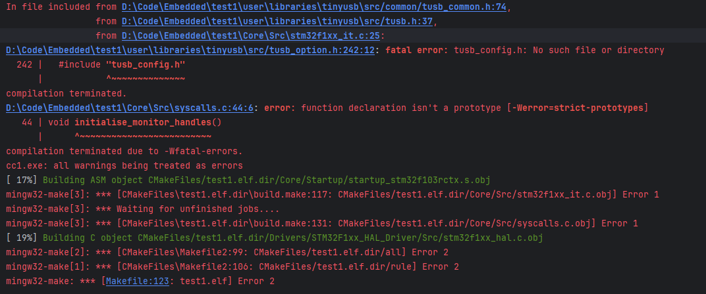
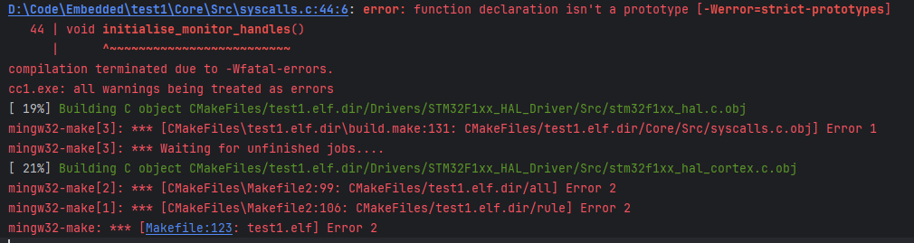
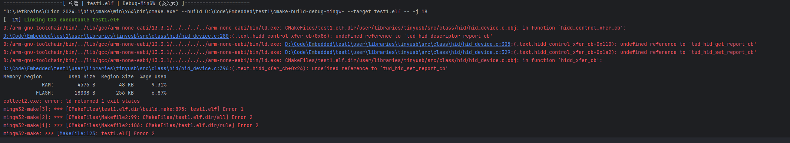

# 使用*TinyUSB*初步实现CDC+HID的USB复合设备  

## 目录

- [有关*TinyUSB*](#有关tinyusb)
- [使用*CLION*进行*STM32*的开发](#使用clion进行stm32的开发)
- [优化*CLION*中的*STM32*项目结构(可选)](#优化clion中的stm32项目结构可选)
- [下载*TinyUSB*](#下载tinyusb)
  - [直接从*TinyUSB*的Github仓库进行下载](#直接从tinyusb的github仓库进行下载)
  - [使用*Git*进行仓库克隆](#使用git进行仓库克隆)
- [创建*STM32*项目](#创建stm32项目)
- [移植*TinyUSB*](#移植tinyusb)
- [USB基础描述符介绍](#usb基础描述符介绍)
- [代码编写](#代码编写)

## 有关*TinyUSB*

[*TInyUSB*](https://github.com/hathach/tinyusb "TinyUSB")是一个开源的USB主机和设备堆栈库，旨在轻量级和高度可移植，非常适合用于嵌入式系统（如微控制器）的 USB 通信开发。它通常用于需要 USB 通信的开发环境，如在 *STM32*、*ESP32* 和其他基于 ARM 的微控制器上构建 USB 设备或主机。

## 使用*CLION*进行*STM32*的开发  

*TinyUSB*使用*Cmake*组织项目结构，如果使用*Keil*进行*STM32*的开发在移植时会稍显麻烦，所以我们选择使用*CLION*进行开发，下面这篇文章详细介绍了该如何配置*CLION*进行*STM32*的开发：[配置*CLion*用于*STM32*开发【优雅の嵌入式开发】](https://zhuanlan.zhihu.com/p/145801160 "配置CLion用于STM32开发【优雅の嵌入式开发】")  
PS：该文章发布时间较早，新版本的*STM32CUBEMX*在创建项目时需要选择*STM32CUBEIDE*的项目进行创建

## 优化*CLION*中的*STM32*项目结构(可选)  

跟着上面的[教程](#使用clion进行stm32的开发)创建好项目后，便可以直接在`main.c`中编写我们的代码，当我们需要导入第三方库时，我们需要通过修改*CLION*项目中的`CmakeLists.txt`来添加库的文件路径与源文件，但这样的问题是当我们重新生成一遍代码后，*CLION*会将项目下的`CMakeLists_template.txt`文件作为`CmakeLists.txt`的创建模板重新生成一个`CmakeLists.txt`，此时我们所做的修改就会丢失。我们当然可以在修改`CmakeLists.txt`后对`CMakeLists_template.txt`进行同步，但这样也太过麻烦，所以我们在项目根目录下创建一个`user`文件夹用来放我们的库文件与代码，文件结构如下所示：  

```null
user/
├── libraries/
├── source/
│   ├── inc/
│   │   ├── user_entrance.h
│   │   └── user_interrupt.h
│   ├── user_entrance.cpp
│   └── user_interrupt.cpp
├── stlink.cfg
├── daplink.cfg
└── user.cmake
```

其中`stlink.cfg`与`daplink.cfg`是给*OpenOCD*使用的配置文件，`user.cmake`是我们为项目创建的cmake模块，只需在`CmakeLists.txt`与`CMakeLists_template.txt`中的`add_executable(${PROJECT_NAME}.elf ${SOURCES} ${LINKER_SCRIPT})`这一句的下方加上一句`include(user/user.cmake)`即可，之后对`CmakeLists.txt`的修改都可以在`user.cmake`中完成。  
此外，`source`文件夹中分别是用户代码的入口函数与用户对中断回调函数的重写。需要注意的是，在修改了项目文件之后，需要重新加载`CMake`项目，具体做法为右键主项目的`CmakeLists.txt`文件并点击`重新加载CMake项目`  
`user`文件夹中的代码可直接打开文件进行参阅：  

- [user_entrance.h](./user/source/inc/user_entrance.h "user_entrance.h")
- [user_entrance.cpp](./user/source/user_entrance.cpp "user_entrance.cpp")
- [user_interrupt.h](./user/source/inc/user_interrupt.h "user_interrupt.h")
- [user_interrupt.cpp](./user/source/user_interrupt.cpp "user_interrupt.cpp")
- [stlink.cfg](./user/stlink.cfg "stlink.cfg")
- [daplink.cfg](./user/daplink.cfg "daplink.cfg")
- [user.cmake](./user/user.cmake "user.cmake")

 用户想要增加代码只需要在`user_entrance.cpp`中的`task_entry()`函数体中添加，想要运行用户的代码，只需要在`main.c`的`main`函数的初始化代码之后，死循环之前调用`user_entrance.cpp`中实现的`task_entry()`函数即可，如下：

 ```c
#include <user_entrance.h>

int main()
{
    InitCode();

    task_entry();  //task_entry中的while(1)循环将会代替下方的while(1)循环，注意不要将循环break掉

    while(1)  //此while(1)循环不可到达
    {
        ;
    }
}
 ```

## 下载*TinyUSB*  

### 直接从*TinyUSB*的[Github仓库](https://github.com/hathach/tinyusb "TinyUSB的Github仓库")进行下载  

- 打开*TinyUSB*的Github仓库，在页面中间的代码窗口的右上角有一个绿色的`Code`按钮，如下图：  
  
- 点击`Code`按钮，并点击弹出窗口的`Download ZIP`，如下图：  

- 在弹出窗口选择下载
- 找到下载的文件并将其解压

### 使用*Git*进行仓库克隆

- 新建一个文件夹用来放置*TinyUSB*的项目文件
- 在此文件夹下打开`PowerShell`(如果已为Git设置环境变量)或`Git Bash`，输入`git clone https://github.com/hathach/tinyusb.git`并回车，等待下载完成即可(如果遇上网络连接问题则考虑使用代理)。  

## 创建*STM32*项目

根据上述[教程](#使用clion进行stm32的开发)创建一个*STM32*的项目，当然需要启用USB外设，USART外设用于调试(可选)，启用USB外设的NVIC中断，之后就可以直接生成代码，不需要*STM32*官方的`USB CLASS`库

## 移植*TinyUSB*  

- 将刚刚下载好的*TinyUSB*源码文件夹打开，在项目的`user/libraries`文件夹下再创建一个`tinyusb`文件夹，并将*TinyUSB*源码文件夹下的`src`文件夹复制过来，并且在`user.cmake`中做出如下修改  
  - 文件结构  

    ```null
    user/
    ├── libraries/
    │   ├── tinyusb/
    │   │   ├── src/
    │   │   │   └── (tinyusb)
    ├── source/
    │   ├── inc/
    │   │   ├── user_entrance.h
    │   │   └── user_interrupt.h
    │   ├── user_entrance.cpp
    │   └── user_interrupt.cpp
    ├── stlink.cfg
    ├── daplink.cfg
    └── user.cmake
    ```

  - 代码修改(`user.cmake`)(直接复制然后全部替换即可)

    ```cmake
    include_directories(${CMAKE_CURRENT_SOURCE_DIR}/user/libraries/tinyusb/src/portable/st/stm32_fsdev) #将stm32相关的驱动头文件添加到包含路径

    add_library(tinyusb_config INTERFACE)  #添加tinyusb配置库

    add_subdirectory(${CMAKE_CURRENT_SOURCE_DIR}/user/libraries/tinyusb/src) #将tinyusb作为子文件夹添加进项目

    file(GLOB user_inc "${CMAKE_CURRENT_SOURCE_DIR}/user/source/inc" "${CMAKE_CURRENT_SOURCE_DIR}/user/libraries/*/inc")

    file(GLOB user_src "${CMAKE_CURRENT_SOURCE_DIR}/user/source/*.c" "${CMAKE_CURRENT_SOURCE_DIR}/user/source/*.cpp"
                        "${CMAKE_CURRENT_SOURCE_DIR}/user/libraries/*/*.c" "${CMAKE_CURRENT_SOURCE_DIR}/user/libraries/*/*.cpp"
                        "${CMAKE_CURRENT_SOURCE_DIR}/user/libraries/tinyusb/src/portable/st/stm32_fsdev/dcd_stm32_fsdev.c") #将stm32相关的驱动头源码添加到项目

    target_sources(${PROJECT_NAME}.elf PRIVATE ${user_src})

    target_include_directories(${PROJECT_NAME}.elf PRIVATE ${user_inc})

    add_tinyusb(${PROJECT_NAME}.elf) #调用tinyusb子文件夹中定义的函数将tinyusb添加到项目

    ```

- 定义tinyusb配置文件  

  做完上述操作之后我们已经成功一大半了，但在构建项目编译时仍会报错，说找不到`tusb_config.h`，这是因为`tusb_config.h`这个配置文件是需要我们自己去定义的。我们只需要在*tinyusb*的项目文件下(就是*tinyusb*的`CMakeLists.txt`所处的目录)创建一个`tusb_config.h`并填入如下代码

  

    ```c
    #ifndef _TUSB_CONFIG_H_
    #define _TUSB_CONFIG_H_

    #define CFG_TUSB_MCU OPT_MCU_STM32F1               //根据自己的设备来选择
    #define CFG_TUSB_RHPORT0_MODE (OPT_MODE_DEVICE | OPT_MODE_FULL_SPEED)
    #define CFG_TUD_ENDPOINT0_SIZE 64

    // 根据需求启用支持的类
    #define CFG_TUD_ENABLED          1                 //是否启用设备栈
    #define CFG_TUD_CDC              0                 //是否启用CDC类
    #define CFG_TUD_MSC              0                 //是否启用MSC类
    #define CFG_TUD_HID              0                 //是否启用HID类
    #define CFG_TUD_MIDI             0                 //是否启用MIDI类
    #define CFG_TUD_VENDOR           0                 //是否启用VENDOR类

    #endif
    ```

  做完这些之后应该就能构建编译了。  

  - 更改编译选项设置

  发现填完保存之后还是不能编译，这是因为我们在`user.cmake`中调用的*tinyusb*的`CmakeLists.txt`中的`add_tinyusb()`函数为编译器加入了一些编译选项，导致编译器严格的语法检查，我们进入并将其中的选项设置全部注释掉即可，如下

      

    ```cmake
    if (CMAKE_C_COMPILER_ID STREQUAL "GNU" OR CMAKE_C_COMPILER_ID STREQUAL "Clang")
    target_compile_options(${TARGET} PRIVATE
    #    -Wall
    #    -Wextra
    #    -Werror
    #    -Wfatal-errors
    #    -Wdouble-promotion
    #    -Wstrict-prototypes
    #    -Wstrict-overflow
    #    -Werror-implicit-function-declaration
    #    -Wfloat-equal
    #    -Wundef
    #    -Wshadow
    #    -Wwrite-strings
    #    -Wsign-compare
    #    -Wmissing-format-attribute
    #    -Wunreachable-code
    #    -Wcast-align
    #    -Wcast-function-type
    #    -Wcast-qual
    #    -Wnull-dereference
    #    -Wuninitialized
    #    -Wunused
    #    -Wunused-function
    #    -Wreturn-type
    #    -Wredundant-decls
        )
    ```

到这里，*tinyusb*的移植就已经完成了。

## USB基础描述符介绍  

- 设备描述符  
  设备描述符提供了关于整个设备的基本信息。它描述了设备的通用属性，比如设备类型、协议标准、厂商和产品信息等。
  
  有关字节的定义如下表所示  

  | 偏移量/字节 | 域               | 大小/字节 | 说明                           |
  |------------|------------------|----------|------------------------------|
  | 0          | bLength         | 1        | 该设备描述符的长度 (18字节)     |
  | 1          | bDescriptorType | 1        | 描述符类型 (设备描述符为0x01)   |
  | 2          | bcdUSB          | 2        | 本设备使用的USB协议版本         |
  | 4          | bDeviceClass    | 1        | 类代码                         |
  | 5          | bDeviceSubClass | 1        | 子类代码                       |
  | 6          | bDeviceProtocol | 1        | 设备协议                       |
  | 7          | bMaxPacketSize0 | 1        | 端点0的最大数据包大小           |
  | 8          | idVendor        | 2        | 厂商ID                         |
  | 10         | idProduct       | 2        | 产品ID                         |
  | 12         | bcdDevice       | 2        | 设备发布编号                   |
  | 14         | iManufacturer   | 1        | 厂商字符串索引                 |
  | 15         | iProduct        | 1        | 产品字符串索引                 |
  | 16         | iSerialNumber   | 1        | 序列号字符串索引               |
  | 17         | bNumConfigurations | 1    | 该设备支持的配置数量           |

- 配置描述符  
  配置描述符描述了设备在特定配置下的特性。一个 USB 设备可以有多个配置（虽然大多数设备只有一个），每个配置可以有不同的功耗、接口和端点布局。  

  有关字节的定义如下表所示  
  
  | 偏移量/字节 | 域                  | 大小/字节 | 说明                               |
  |:------------:|:---------------------:|:----------:|:----------------------------------:|
  | 0          | bLength            | 1        | 描述符长度 (9字节)                  |
  | 1          | bDescriptorType    | 1        | 描述符类型 (配置描述符为0x02)         |
  | 2          | wTotalLength       | 2        | 配置的总长度，包括所有接口和端点描述符 |
  | 4          | bNumInterfaces     | 1        | 此配置支持的接口数量                 |
  | 5          | bConfigurationValue | 1       | 用于选择此配置的值                  |
  | 6          | iConfiguration     | 1        | 配置字符串描述符的索引               |
  | 7          | bmAttributes       | 1        | 配置属性                            |
  | 8          | bMaxPower          | 1        | 设备最大功耗                        |

- 接口描述符  
  接口描述符描述设备的一个特定功能接口。一个配置可以包含多个接口，每个接口可以有自己的端点和协议。例如，复合设备（如一个带有摄像头和麦克风的 USB 设备）可以有一个视频接口和一个音频接口。  

  有关字节的定义如下表所示  
  
  | 偏移量/字节 | 域                | 大小/字节 | 说明                       |
  |:------------:|:-------------------:|----------|:--------------------------:|
  | 0          | bLength          | 1        | 描述符长度 (9字节)          |
  | 1          | bDescriptorType  | 1        | 描述符类型 (接口描述符为0x04) |
  | 2          | bInterfaceNumber | 1        | 接口编号                    |
  | 3          | bAlternateSetting | 1       | 备用设置编号                |
  | 4          | bNumEndpoints    | 1        | 此接口支持的端点数量         |
  | 5          | bInterfaceClass  | 1        | 类代码                     |
  | 6          | bInterfaceSubClass | 1     | 子类代码                   |
  | 7          | bInterfaceProtocol | 1     | 协议代码                   |
  | 8          | iInterface       | 1        | 接口字符串描述符的索引       |

- 端点描述符  
  端点描述符描述接口中的一个端点（Endpoint）。端点是主机与设备之间传输数据的通道，每个接口可以包含多个端点，用于不同的传输类型（如中断传输、批量传输等）。  

    有关字节的定义如下表所示  

  | 偏移量/字节 | 域                | 大小/字节 | 说明                            |
  |:------------:|:-------------------:|:----------:|:-------------------------------:|
  | 0          | bLength          | 1        | 描述符长度 (7字节)               |
  | 1          | bDescriptorType  | 1        | 描述符类型 (端点描述符为0x05)      |
  | 2          | bEndpointAddress | 1        | 端点地址和方向                    |
  | 3          | bmAttributes     | 1        | 端点属性                         |
  | 4          | wMaxPacketSize   | 2        | 此端点的最大数据包大小             |
  | 6          | bInterval        | 1        | 轮询间隔 (仅用于中断、等时和同步传输) |

- 字符串描述符  
  字符串描述符用于为设备提供人类可读的信息，如制造商名称、产品名称和序列号。字符串描述符包含 Unicode 编码的文本信息，可以由主机读取并显示。  

  有关字节的定义如下表所示  
  
  | 偏移量/字节 | 域               | 大小/字节 | 说明                       |
  |:------------:|:------------------:|:----------:|:--------------------------:|
  | 0          | bLength         | 1        | 描述符长度                 |
  | 1          | bDescriptorType | 1        | 描述符类型 (字符串描述符为0x03) |
  | 2          | bString         | 可变长度   | UNICODE 编码的字符串         |

## 代码编写  

我们到`tinyusb_config.h`中对CDC类与HID类的宏定义进行修改

```c
//修改宏定义
#define CFG_TUD_CDC              1
#define CFG_TUD_HID              1

//新增宏定义
#define CFG_TUD_CDC_RX_BUFSIZE 512              // CDC 接收端点缓冲区大小
#define CFG_TUD_CDC_TX_BUFSIZE 512              // CDC 发送端点缓冲区大小
#define CFG_TUD_HID_EP_BUFSIZE  64              // HID 端点缓冲区大小
```

并在`user_entrance.cpp`或`main.c`(如果没有进行项目结构优化)中包含相关头文件

```c
#include <tusb.h>
#include <class/cdc/cdc_device.h>
#include <class/hid/hid_device.h>
```

### 基础回调实现  

在`tusb_init()`的`while(1)`循环之前，外设初始化完毕之后调用，在USB的全局中断处理函数中调用`tusb_int_handler(0, true)`(首先需要包含`tusb.h`)，并在`task_entry()`或`main()`(如果没有进行项目结构优化)中的`while(1)`循环中调用`tud_task()`处理USB相关事件，点击编译，会发现编译报错，这是因为一些必要的回调函数我们还没有定义，我们接下来对它们进行定义。



在*TinyUSB*中，我们不需要关注底层的USB通信的实现，我们只需要定义相应的描述符并完成其对应的回调函数就能让主机成功地识别设备。  
*TinyUSB*中，提供了一些结构体类型与宏定义来帮助用户更简单方便地定义描述符，下面简单介绍一下

- 设备描述符  
  对于设备描述符，*TinyUSB*提供了结构体类型`tusb_desc_device_t`来帮助用户定义设备描述符。
  结构体定义如下

  ```c
  typedef struct TU_ATTR_PACKED {
  uint8_t  bLength            ; ///< Size of this descriptor in bytes.
  uint8_t  bDescriptorType    ; ///< DEVICE Descriptor Type.
  uint16_t bcdUSB             ; ///< BUSB Specification Release Number in Binary-Coded Decimal (i.e., 2.10 is 210H).

  uint8_t  bDeviceClass       ; ///< Class code (assigned by the USB-IF).
  uint8_t  bDeviceSubClass    ; ///< Subclass code (assigned by the USB-IF).
  uint8_t  bDeviceProtocol    ; ///< Protocol code (assigned by the USB-IF).
  uint8_t  bMaxPacketSize0    ; ///< Maximum packet size for endpoint zero (only 8, 16, 32, or 64 are valid). For HS devices is fixed to 64.

  uint16_t idVendor           ; ///< Vendor ID (assigned by the USB-IF).
  uint16_t idProduct          ; ///< Product ID (assigned by the manufacturer).
  uint16_t bcdDevice          ; ///< Device release number in binary-coded decimal.
  uint8_t  iManufacturer      ; ///< Index of string descriptor describing manufacturer.
  uint8_t  iProduct           ; ///< Index of string descriptor describing product.
  uint8_t  iSerialNumber      ; ///< Index of string descriptor describing the device's serial number.

  uint8_t  bNumConfigurations ; ///< Number of possible configurations.
  } tusb_desc_device_t;
  ```

  用户只需要定义一个`tusb_desc_device_t`类型结构体变量然后在获取设备描述符的回调函数`const uint8_t*  tud_descriptor_device_cb()`中将其返回即可。下面是使用示例

  ```c
  tusb_desc_device_t const tusb_desc_device = {
    .bLength =                      0x12,
    .bDescriptorType =              TUSB_DESC_DEVICE,
    .bcdUSB =                       0x0200,
    .bDeviceClass =                 0xEF,
    .bDeviceSubClass =              0x02,
    .bDeviceProtocol =              0x01,
    .bMaxPacketSize0 =              64U,
    .idVendor =                     0x0483,
    .idProduct =                    0x0001,
    .bcdDevice =                    0x0001,
    .iManufacturer =                0x01,
    .iProduct =                     0x02,
    .iSerialNumber =                0x03,
    .bNumConfigurations =           0x01,
  };

  uint8_t const*  tud_descriptor_device_cb()
  {
    return (uint8_t const*)&tusb_desc_device;
  }
  ```

- 配置描述符  
  在USB通信中，我们一般将配置描述符、接口描述符与端点描述符一起发送，所以我们定义的配置描述符数组将包括这三项。
  *TinyUSB*中提供了配置描述符与USB各种接口功能类的标准宏定义，这次只说明配置描述符与CDC和HID的接口类描述符，如下
  
  ```c
  #define TUD_CONFIG_DESC_LEN   (9)
  #define TUD_CDC_DESC_LEN  (8+9+5+5+4+5+7+9+7+7)
  #define TUD_HID_DESC_LEN    (9 + 9 + 7)

  enum {
  TUSB_DESC_CONFIG_ATT_REMOTE_WAKEUP = 1u << 5, //支持远程唤醒
  TUSB_DESC_CONFIG_ATT_SELF_POWERED  = 1u << 6, //自供电
  };
  /*
  *@param config_num 配置编号，从1开始计数
  *@param _itfcount 配置所使用的接口总数
  *@param _stridx 字符串描述符索引
  *@param _total_len 配置描述符总长度
  *@param _attribute 上述枚举类中的属性，可使用或运算，默认可填0
  *@param _power_ma 设备从USB口请求的电流
  */
  #define TUD_CONFIG_DESCRIPTOR(config_num, _itfcount, _stridx, _total_len, _attribute, _power_ma)
  /*@param _itfnum 该接口使用的接口号
  *@param _stridx 字符串描述符索引
  *@param _ep_notif 通知端点地址 (IN)
  *@param _ep_notif_size 通知端点最大包大小
  *@param _epout 数据 OUT 端点地址
  *@param _epin 数据 IN 端点地址
  *@param _epsize 数据端点最大包大小
  */
  #define TUD_CDC_DESCRIPTOR(_itfnum, _stridx, _ep_notif, _ep_notif_size, _epout, _epin, _epsize)

  typedef enum
  {
  HID_ITF_PROTOCOL_NONE     = 0, ///< None
  HID_ITF_PROTOCOL_KEYBOARD = 1, ///< Keyboard
  HID_ITF_PROTOCOL_MOUSE    = 2  ///< Mouse
  }hid_interface_protocol_enum_t;
  /*@param _itfnum 该接口使用的接口号
  *@param _stridx 字符串描述符索引
  *@param _boot_protocol HID设备协议，可填入上方定义的枚举类，不可使用或运算
  *@param _report_desc_len 报告描述符长度
  *@param _epin 数据 IN 端点地址
  *@param _epsize 数据端点最大包大小
  *@param _ep_interval 轮询时间，单位ms
  */
  #define TUD_HID_DESCRIPTOR(_itfnum, _stridx, _boot_protocol, _report_desc_len, _epin, _epsize, _ep_interval)
  ```

  用户只需要定义一个数组，将配置描述符放入然后在配置描述符回调中返回即可。示例如下

  ```c
  #define CONFIG_TOTAL_LEN (TUD_CONFIG_DESC_LEN+TUD_CDC_DESC_LEN+TUD_HID_DESC_LEN)
  uint8_t const desc_configuration[] = {
    // 配置描述符
    TUD_CONFIG_DESCRIPTOR(1, 3, 0, CONFIG_TOTAL_LEN, 0, 100),
    // CDC 接口描述符
    TUD_CDC_DESCRIPTOR(0, 3, 0x81, 8, 0x02, 0x82, 64),
    // HID接口描述符
    TUD_HID_DESCRIPTOR(2, 3, HID_ITF_PROTOCOL_KEYBOARD, sizeof(hid_report_desc), 0x84, 8, 10)
  };
  uint8_t const* tud_descriptor_configuration_cb(uint8_t index)
  {
    return desc_configuration;
  }
  ```

  需要注意的是，CDC类虽然看起来是一个接口，但实际上使用了两个接口，一个用于控制传输一个用于数据传输，使用IAR描述符进行连接，而HID类只有一个接口，所以接口总数应该填入`3`

- HID报告描述符  
  HID报告描述符规定了HID设备返回给主机的HID报文的格式，具体的规定在此不做赘述，*TinyUSB*提供了标准的HID键盘与鼠标的报文格式，但是由于使用*TinyUSB*的宏定义定义的HID键盘设备只有一个IN端点并没有OUT端点，所以并不能使用标准的HID键盘报文格式，需要将其中OUT端点的部分给删除，报告描述符定义与相关回调函数实现如下  
  需要注意的是，因为HID的接口描述符中需要传输报告描述符的长度，所以需要将报告描述符的定义写在配置描述符**之前**。

  ```c
  uint8_t const hid_report_desc[] = 
  {
    0x05, 0x01,        // Usage Page (Generic Desktop)
    0x09, 0x06,        // Usage (Keyboard)
    0xA1, 0x01,        // Collection (Application)

    // 修饰键（如 Ctrl、Shift 等）
    0x05, 0x07,        // Usage Page (Keyboard/Keypad)
    0x19, 0xE0,        // Usage Minimum (Left Control)
    0x29, 0xE7,        // Usage Maximum (Right GUI)
    0x15, 0x00,        // Logical Minimum (0)
    0x25, 0x01,        // Logical Maximum (1)
    0x75, 0x01,        // Report Size (1)
    0x95, 0x08,        // Report Count (8)
    0x81, 0x02,        // Input (Data, Var, Abs)

    // 保留字节
    0x95, 0x01,        // Report Count (1)
    0x75, 0x08,        // Report Size (8)
    0x81, 0x01,        // Input (Cnst, Ary, Abs)

    // 按键数组
    0x95, 0x06,        // Report Count (6)
    0x75, 0x08,        // Report Size (8)
    0x15, 0x00,        // Logical Minimum (0)
    0x25, 0x65,        // Logical Maximum (101)
    0x05, 0x07,        // Usage Page (Keyboard/Keypad)
    0x19, 0x00,        // Usage Minimum (Reserved)
    0x29, 0x65,        // Usage Maximum (Keyboard Application)
    0x81, 0x00,        // Input (Data, Ary, Abs)

    0xC0               // End Collection
  };

  uint8_t const* tud_hid_descriptor_report_cb(uint8_t itf){
    return hid_report_desc;
  }

  void tud_hid_set_report_cb(uint8_t instance, uint8_t report_id, hid_report_type_t report_type, uint8_t const* buffer, uint16_t bufsize)
  {
    //处理接收到的报文
  }

  uint16_t tud_hid_get_report_cb(uint8_t instance, uint8_t report_id, hid_report_type_t report_type, uint8_t* buffer, uint16_t reqlen)
  {
    return 0;
  } 
  /*
  此回调函数是主机向设备请求报文时的回调函数，如果想要实现自动返回报文可将根据instance和report_id将对应接口的报文内容填入buffer中，reqlen是主机请求的字节数,并返回实际填入的字节数，我们选择手动发送报文，所以我们直接return 0
  */
  ```

- 字符串描述符

  本教程主要说明功能部分的实现部分，字符串描述符为可选项，我们直接返回NULL指针

  ```c
  uint16_t const* tud_descriptor_string_cb(uint8_t index, uint16_t langid)
  {
    return NULL;
  }

  ```

到这里，描述符的回调函数就已经实现完成了，我们再次点击编译就能直接编译成功了。

### 功能实现

- 串口发送与接收  
  - 发送  
  要使用虚拟串口发送数据，直接调用`tud_cdc_write(void const* buffer, uint32_t bufsize)`即可，但是为了安全性，我们可以加一个`if`判断CDC是否准备好发送数据

  ```c
  if(tud_cdc_ready())
  {
    char* data_to_send = "Hello USB!";
    tud_cdc_write(data_to_send, strlen(data_to_send));
  }
  ```

  - 接收
  使用虚拟串口接收数据需要实现CDC类的接收数据回调`void tud_cdc_rx_cb(uint8_t itf)`，形参`ift`是接口号，在拥有多个CDC类时可以对接口进行区分。  
  下面是使用示例

  ```c
  void tud_cdc_rx_cb(uint8_t itf){
      uint8_t buf[CFG_TUD_CDC_RX_BUFSIZE];
      uint32_t count = tud_cdc_read(buf, sizeof(buf));
      //在下方添加数据处理
  }
  ```

  这样实现CDC的接收回调之后就能使用虚拟串口来接收信息了。

- HID报文的发送与接收
  - 发送  
    我们先定义一个数组用于存储将要发送的HID报文，根据我们上面所写的报告描述符所定义的格式，报文共有八字节，第一个字节是一些控制按键的状态，第二个字节是保留字节，定义为0x00，后六个字节都是按下按键的键值。

    ```c
    uint8_t report_buffer[]={0x00,0x00,0x44,0x00,0x00,0x00,0x00,0x00};
    ```

    如果我们想要将这个报文发送，我们可以调用`tud_hid_report(uint8_t report_id, void const* report, uint16_t len)`来发送报文，对于只有一种报告的情况，`report_id`传入0即可  
    使用示例如下

    ```c
    tud_hid_report(0, report, sizeof(report));
    ```

    如果我们想要表示`A`被按下，我们只需要将`report[2]`至`report[7]`的任一字节改为`A`的HID键值再发送即可，更改回0再发送则表示松开。  
    示例如下

    ```c
    report_buffer[2] = 0x04;
    tud_hid_report(0,report,sizeof(report));
    Delay_ms(500);
    report_buffer[2]=0;
    tud_hid_report(0,report,sizeof(report));
    ```

    上述示例实现的功能是将`A`按下500ms并抬起。  

  - 接收  
  想要接收来自主机的HID报文只需要在`void tud_hid_set_report_cb(uint8_t instance, uint8_t report_id, hid_report_type_t report_type, uint8_t const* buffer, uint16_t bufsize)`中写入对于报文的处理代码即可。

## 成功🍾🍾🍾

到这，你已经成功初步实现了CDC+HID的USB复合设备了。恭喜🎉🎉🎉！你现在可以去更深入地了解USB，给这个设备加上其他功能，例如增加字符串描述符，修改报告描述符使键盘实现全键无冲的功能。既可以弄一个音游手台来推分，也能弄一个能够自己打字的键盘，~~还能弄一个弹道偏左的键盘来整蛊朋友~~。Have Fun！！！
